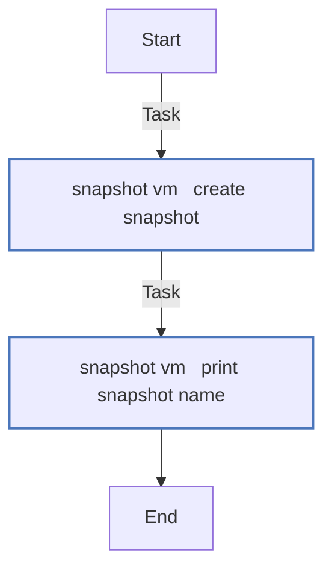
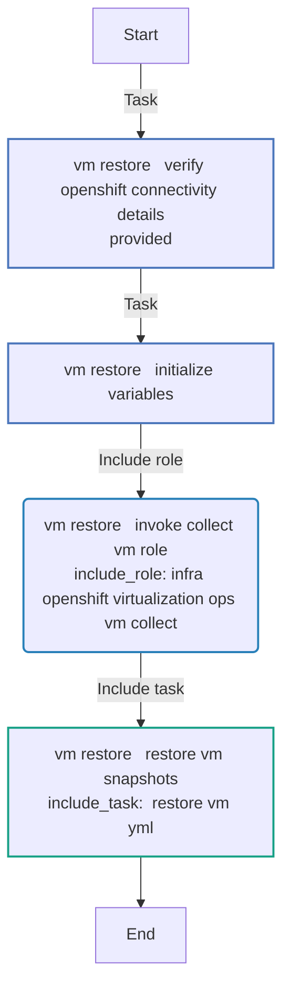
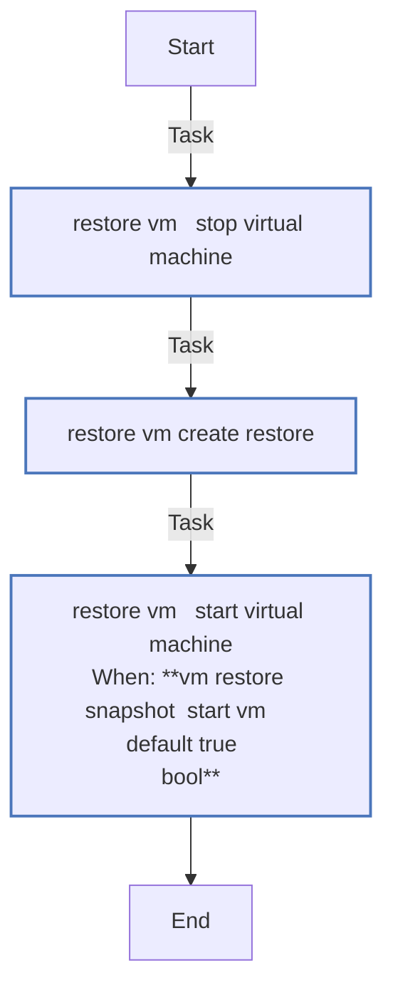
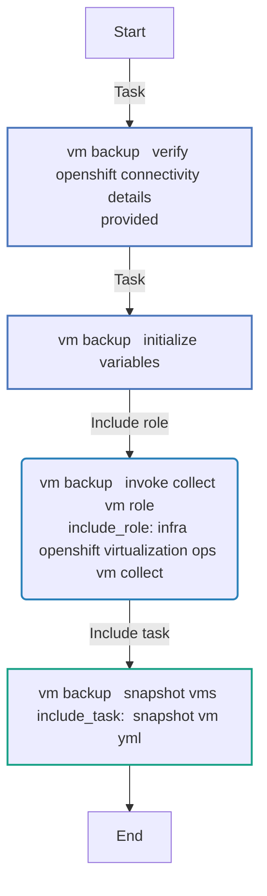
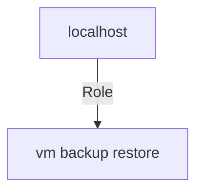

<!-- STATIC CONTENT START
Use this section for adding additional content to the README
This will not be overwritten by Docsible -->
# 📃 Role overview

This role performs a backup and restore of a virtual machine by using VM snapshots. Performing the following actions:

* Create a new Snapshot
* Restore a virtual machine from a snapshot

<!-- STATIC CONTENT END -->
<!-- Everything below will be overwritten by Docsible -->
<!-- DOCSIBLE START -->
## vm_backup_restore

```
Role belongs to infra/openshift_virtualization_ops
Namespace - infra
Collection - openshift_virtualization_ops
Version - 1.0.3
Repository - https://github.com/redhat-cop/openshift_virtualization_ops
```

Description: Virtual Machine backup and restore capabilities.

### Defaults

**These are static variables with lower priority**

#### File: defaults/main.yml

| Var          | Type         | Value       |Choices    |Required    | Title       |
|--------------|--------------|-------------|-------------|-------------|-------------|
| [`vm_backup_restore_request`](defaults/main.yml#L7)   | list   | `[]` |  None  |   True  |  Backup and restore list |
| [`vm_backup_restore_kubevirt_api_version`](defaults/main.yml#L18)   | str   | `kubevirt.io/v1` |  None  |   True  |  KubeVirt API version |
| [`vm_backup_restore_snapshot_kubevirt_api_version`](defaults/main.yml#L23)   | str   | `snapshot.kubevirt.io/v1alpha1` |  None  |   True  |  KubeVirt API snapshot version |
| [`vm_backup_restore_openshift_host`](defaults/main.yml#L28)   | str   | `{{ openshift_host ¦ default(lookup('ansible.builtin.env', 'K8S_AUTH_HOST')) }}` |  None  |   True  |  Location of the OpenShift host |
| [`vm_backup_restore_openshift_api_key`](defaults/main.yml#L33)   | str   | `<multiline value: folded_strip>` |  None  |   True  |  OpenShift API key |
| [`vm_backup_restore_openshift_verify_ssl`](defaults/main.yml#L40)   | str   | `<multiline value: folded_strip>` |  None  |   True  |  OpenShift SSL certificate verification |
| [`vm_backup_restore_collect_obj_default_api_version`](defaults/main.yml#L46)   | str   | `{{ vm_backup_restore_kubevirt_api_version }}` |  None  |   True  |  KubeVirt API version |
| [`vm_backup_restore_collect_obj_default_kind`](defaults/main.yml#L51)   | str   | `VirtualMachine` |  None  |   True  |  Backup and restore default kind |
| [`vm_backup_restore_vm_wait_timeout`](defaults/main.yml#L56)   | int   | `300` |  None  |   True  |  VM wait timeout |
| [`vm_backup_restore_vm_snapshot_wait_timeout`](defaults/main.yml#L61)   | int   | `600` |  None  |   True  |  VM snapshot wait timeout |
| [`vm_backup_restore_vm_restore_wait_timeout`](defaults/main.yml#L66)   | int   | `600` |  None  |   True  |  VM restore wait timeout |

<summary><b>🖇️ Full descriptions for vars in defaults/main.yml</b></summary>
<br>
<b>`vm_backup_restore_request`:</b> A list of requests for backup and restore
<br>
<b>`vm_backup_restore_kubevirt_api_version`:</b> KubeVirt API version
<br>
<b>`vm_backup_restore_snapshot_kubevirt_api_version`:</b> KubeVirt API snapshot version
<br>
<b>`vm_backup_restore_openshift_host`:</b> name of OpenShift host
<br>
<b>`vm_backup_restore_openshift_api_key`:</b> OpenShift API key
<br>
<b>`vm_backup_restore_openshift_verify_ssl`:</b> OpenShift SSL certificate verification
<br>
<b>`vm_backup_restore_collect_obj_default_api_version`:</b> KubeVirt API version
<br>
<b>`vm_backup_restore_collect_obj_default_kind`:</b> Default resource for the backup and restore
<br>
<b>`vm_backup_restore_vm_wait_timeout`:</b> Amount of time to wait for VM lifecycle actions to complete
<br>
<b>`vm_backup_restore_vm_snapshot_wait_timeout`:</b> Amount of time to wait for VM snapshot to be completed
<br>
<b>`vm_backup_restore_vm_restore_wait_timeout`:</b> Amount of time to wait for VM snapshot to be completed
<br>
<br>

### Vars

**These are variables with higher priority**

#### File: vars/main.yml

| Var          | Type         | Value       |
|--------------|--------------|-------------|
| [vm_backup_restore_valid_vm_backup_restore_operations](vars/main.yml#L4)   | list   | `[]` |
| [vm_backup_restore_valid_vm_backup_restore_operations.0](vars/main.yml#L5)   | str   | `snapshot` |
| [vm_backup_restore_valid_vm_backup_restore_operations.1](vars/main.yml#L6)   | str   | `snapshot_restore` |

### Tasks

#### File: tasks/_restore_vm.yml

| Name | Module | Has Conditions |
| ---- | ------ | --------- |
| _restore_vm ¦ Stop Virtual Machine | `redhat.openshift_virtualization.kubevirt_vm` | False |
| _restore_vm ¦ Create Restore | `redhat.openshift.k8s` | False |
| _restore_vm ¦ Start Virtual Machine | `redhat.openshift_virtualization.kubevirt_vm` | True |

#### File: tasks/_snapshot_vm.yml

| Name | Module | Has Conditions |
| ---- | ------ | --------- |
| _snapshot_vm ¦ Create Snapshot | `redhat.openshift.k8s` | False |
| _snapshot_vm ¦ Print Snapshot Name | `ansible.builtin.debug` | False |

#### File: tasks/vm_backup.yml

| Name | Module | Has Conditions |
| ---- | ------ | --------- |
| vm_backup ¦ Verify OpenShift Connectivity Details Provided | `ansible.builtin.assert` | False |
| vm_backup ¦ Initialize Variables | `ansible.builtin.set_fact` | False |
| vm_backup ¦ Invoke Collect VM Role | `ansible.builtin.include_role` | False |
| vm_backup ¦ Snapshot VMs' | `ansible.builtin.include_tasks` | False |

#### File: tasks/vm_restore.yml

| Name | Module | Has Conditions |
| ---- | ------ | --------- |
| vm_restore ¦ Verify OpenShift Connectivity Details Provided | `ansible.builtin.assert` | False |
| vm_restore ¦ Initialize Variables | `ansible.builtin.set_fact` | False |
| vm_restore ¦ Invoke Collect VM Role | `ansible.builtin.include_role` | False |
| vm_restore ¦ Restore VM Snapshots | `ansible.builtin.include_tasks` | False |

## Task Flow Graphs

### Graph for _snapshot_vm.yml



### Graph for vm_restore.yml



### Graph for _restore_vm.yml



### Graph for vm_backup.yml



## Playbook

```yml
---
- name: Test
  hosts: localhost
  remote_user: root
  roles:
    - vm_backup_restore
...

```

## Playbook graph



## Author Information

OpenShift Virtualization Migration Contributors

## License

GPL-3.0-only

## Minimum Ansible Version

2.15.0

## Platforms

No platforms specified.

<!-- DOCSIBLE END -->