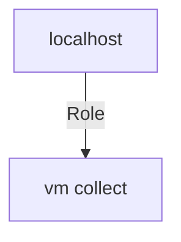

<!-- STATIC CONTENT START
Use this section for adding additional content to the README
This will not be overwritten by Docsible -->
# 📃 Role overview

<!-- STATIC CONTENT END -->
<!-- Everything below will be overwritten by Docsible -->
<!-- DOCSIBLE START -->
## vm_collect

```
Role belongs to infra/openshift_virtualization_ops
Namespace - infra
Collection - openshift_virtualization_ops
Version - 1.0.3
Repository - https://github.com/redhat-cop/openshift_virtualization_ops
```

Description: Collection of Migration Toolkit for Virtualization inventory information.

### Defaults

**These are static variables with lower priority**

#### File: defaults/main.yml

| Var          | Type         | Value       |Choices    |Required    | Title       |
|--------------|--------------|-------------|-------------|-------------|-------------|
| [`vm_collect_obj_default_api_version`](defaults/main.yml#L4)   | str   | `kubevirt.io/v1` |  None  |   None  |  None |
| [`vm_collect_obj_default_kind`](defaults/main.yml#L5)   | str   | `VirtualMachine` |  None  |   None  |  None |

<summary><b>🖇️ Full descriptions for vars in defaults/main.yml</b></summary>
<br>
<b>`vm_collect_obj_default_api_version`:</b> None
<br>
<b>`vm_collect_obj_default_kind`:</b> None
<br>
<br>

### Tasks

#### File: tasks/main.yml

| Name | Module | Has Conditions |
| ---- | ------ | --------- |
| Verify Request Variable Provided | `ansible.builtin.assert` | False |
| Verify Valid Result Variable Provided | `ansible.builtin.assert` | False |
| Verify Namespace Provided When Name Specified | `ansible.builtin.assert` | True |
| Query Without Label Selector - {{ vm_collect_obj ¦ default(vm_collect_obj_default_kind) }} | `block` | True |
| Query Without Label Selector {{ vm_collect_obj ¦ default(vm_collect_obj_default_kind) }} | `kubernetes.core.k8s_info` | False |
| Add (Without Label Selector) {{ vm_collect_obj ¦ default(vm_collect_obj_default_kind) }} | `ansible.builtin.set_fact` | True |
| Query Using Label Selector - {{ vm_collect_obj ¦ default(vm_collect_obj_default_kind) }} | `block` | True |
| Query (With Label Selector) - {{ vm_collect_obj ¦ default(vm_collect_obj_default_kind) }} | `kubernetes.core.k8s_info` | False |
| Add (With Label Selector) - {{ vm_collect_obj ¦ default(vm_collect_obj_default_kind) }} | `ansible.builtin.set_fact` | True |

## Task Flow Graphs

### Graph for main.yml

```mermaid
flowchart TD
Start
classDef block stroke:#3498db,stroke-width:2px;
classDef task stroke:#4b76bb,stroke-width:2px;
classDef includeTasks stroke:#16a085,stroke-width:2px;
classDef importTasks stroke:#34495e,stroke-width:2px;
classDef includeRole stroke:#2980b9,stroke-width:2px;
classDef importRole stroke:#699ba7,stroke-width:2px;
classDef includeVars stroke:#8e44ad,stroke-width:2px;
classDef rescue stroke:#665352,stroke-width:2px;

  Start-->|Task| Verify_Request_Variable_Provided0[verify request variable provided]:::task
  Verify_Request_Variable_Provided0-->|Task| Verify_Valid_Result_Variable_Provided1[verify valid result variable provided]:::task
  Verify_Valid_Result_Variable_Provided1-->|Task| Verify_Namespace_Provided_When_Name_Specified2[verify namespace provided when name specified<br>When: **name  in vm collect request instance**]:::task
  Verify_Namespace_Provided_When_Name_Specified2-->|Block Start| Query_Without_Label_Selector______vm_collect_obj___default_vm_collect_obj_default_kind____3_block_start_0[[query without label selector      vm collect obj  <br>default vm collect obj default kind    <br>When: **label selectors  not in vm collect request<br>instance**]]:::block
  Query_Without_Label_Selector______vm_collect_obj___default_vm_collect_obj_default_kind____3_block_start_0-->|Task| Query_Without_Label_Selector____vm_collect_obj___default_vm_collect_obj_default_kind____0[query without label selector    vm collect obj  <br>default vm collect obj default kind    ]:::task
  Query_Without_Label_Selector____vm_collect_obj___default_vm_collect_obj_default_kind____0-->|Task| Add__Without_Label_Selector_____vm_collect_obj___default_vm_collect_obj_default_kind____1[add  without label selector     vm collect obj  <br>default vm collect obj default kind    <br>When: **lookup  ansible builtin vars   vm collect vms var<br> default       map attribute  response obj    <br>list    selectattr  metadata namespace    equalto <br> vm collect no label selectors response metadata<br>namespace    list   selectattr  metadata name   <br>equalto   vm collect no label selectors response<br>metadata name    list   length    0 and  <br>namespace  in vm collect request instance and <br>names  in vm collect request instance and vm<br>collect no label selectors response metadata name<br>in vm collect request instance  names    or  <br>namespace  in vm collect request instance and <br>names  not in vm collect request instance  or  <br>namespace  not in vm collect request instance**]:::task
  Add__Without_Label_Selector_____vm_collect_obj___default_vm_collect_obj_default_kind____1-.->|End of Block| Query_Without_Label_Selector______vm_collect_obj___default_vm_collect_obj_default_kind____3_block_start_0
  Add__Without_Label_Selector_____vm_collect_obj___default_vm_collect_obj_default_kind____1-->|Block Start| Query_Using_Label_Selector______vm_collect_obj___default_vm_collect_obj_default_kind____4_block_start_0[[query using label selector      vm collect obj  <br>default vm collect obj default kind    <br>When: **label selectors  in vm collect request instance**]]:::block
  Query_Using_Label_Selector______vm_collect_obj___default_vm_collect_obj_default_kind____4_block_start_0-->|Task| Query__With_Label_Selector_______vm_collect_obj___default_vm_collect_obj_default_kind____0[query  with label selector       vm collect obj  <br>default vm collect obj default kind    ]:::task
  Query__With_Label_Selector_______vm_collect_obj___default_vm_collect_obj_default_kind____0-->|Task| Add__With_Label_Selector_______vm_collect_obj___default_vm_collect_obj_default_kind____1[add  with label selector       vm collect obj  <br>default vm collect obj default kind    <br>When: **lookup  ansible builtin vars   vm collect vms var<br> default       map attribute  response obj    <br>list    selectattr  metadata namespace    equalto <br> vm collect label selectors response metadata<br>namespace    list   selectattr  metadata name   <br>equalto   vm collect label selectors response<br>metadata name    list   length    0**]:::task
  Add__With_Label_Selector_______vm_collect_obj___default_vm_collect_obj_default_kind____1-.->|End of Block| Query_Using_Label_Selector______vm_collect_obj___default_vm_collect_obj_default_kind____4_block_start_0
  Add__With_Label_Selector_______vm_collect_obj___default_vm_collect_obj_default_kind____1-->End
```



## Playbook

```yml
---
- name: Test
  hosts: localhost
  remote_user: root
  roles:
    - vm_collect
...

```

## Playbook graph



## Author Information

OpenShift Virtualization Migration Contributors

## License

GPL-3.0-only

## Minimum Ansible Version

2.15.0

## Platforms

No platforms specified.

<!-- DOCSIBLE END -->