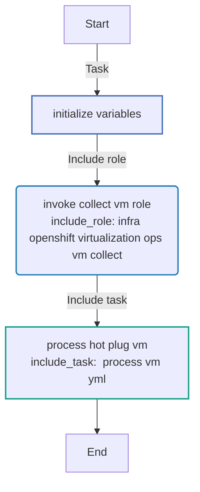
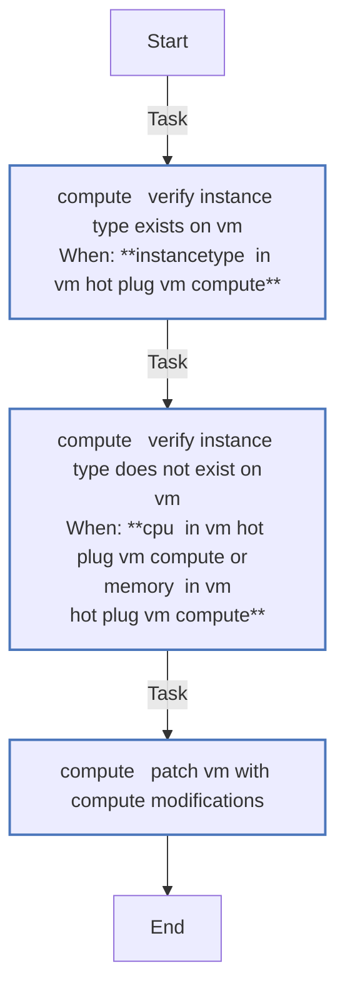
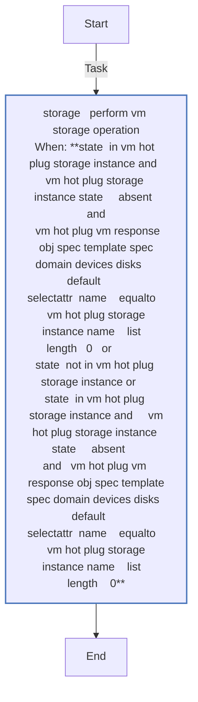
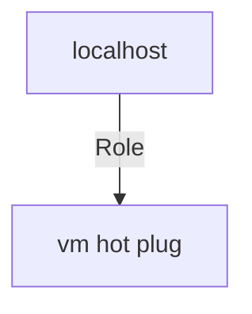

<!-- STATIC CONTENT START
Use this section for adding additional content to the README
This will not be overwritten by Docsible -->
# 📃 Role overview

This role performs hot plugging in a virtual machine.

<!-- STATIC CONTENT END -->
<!-- Everything below will be overwritten by Docsible -->
<!-- DOCSIBLE START -->
## vm_hot_plug

```
Role belongs to infra/openshift_virtualization_ops
Namespace - infra
Collection - openshift_virtualization_ops
Version - 1.0.3
Repository - https://github.com/redhat-cop/openshift_virtualization_ops
```

Description: Hot Plug Virtual Machine resources.

### Defaults

**These are static variables with lower priority**

#### File: defaults/main.yml

| Var          | Type         | Value       |Choices    |Required    | Title       |
|--------------|--------------|-------------|-------------|-------------|-------------|
| [`vm_hot_plug_request`](defaults/main.yml#L7)   | list   | `[]` |  None  |   True  |  Hot Plug Requests |
| [`vm_hot_plug_openshift_host`](defaults/main.yml#L26)   | str   | `{{ openshift_host }}` |  None  |   True  |  OpenShift Host |
| [`vm_hot_plug_api_key`](defaults/main.yml#L30)   | str   | `{{ openshift_api_key }}` |  None  |   True  |  OpenShift API Key |
| [`vm_hot_plug_openshift_verify_ssl`](defaults/main.yml#L34)   | str   | `{{ openshift_verify_ssl }}` |  None  |   True  |  Verify SSL Certificate |
| [`vm_hot_plug_kubevirt_api_version`](defaults/main.yml#L38)   | str   | `kubevirt.io/v1` |  None  |   True  |  KubeVirt API Version |

<summary><b>🖇️ Full descriptions for vars in defaults/main.yml</b></summary>
<br>
<b>`vm_hot_plug_request`:</b> List of Hot Plug Requests
<br>
<b>`vm_hot_plug_openshift_host`:</b> OpenShift Host
<br>
<b>`vm_hot_plug_api_key`:</b> OpenShift API Key
<br>
<b>`vm_hot_plug_openshift_verify_ssl`:</b> Verify SSL Certificate
<br>
<b>`vm_hot_plug_kubevirt_api_version`:</b> KubeVirt API Version
<br>
<br>

### Tasks

#### File: tasks/main.yml

| Name | Module | Has Conditions |
| ---- | ------ | --------- |
| Initialize Variables | `ansible.builtin.set_fact` | False |
| Invoke Collect VM Role | `ansible.builtin.include_role` | False |
| Process Hot Plug VM | `ansible.builtin.include_tasks` | False |

#### File: tasks/_compute.yml

| Name | Module | Has Conditions |
| ---- | ------ | --------- |
| _compute ¦ Verify Instance Type exists on VM | `ansible.builtin.assert` | True |
| _compute ¦ Verify Instance Type does not exist on VM | `ansible.builtin.assert` | True |
| _compute ¦ Patch VM with Compute Modifications | `kubernetes.core.k8s_json_patch` | False |

#### File: tasks/_process_vm.yml

| Name | Module | Has Conditions |
| ---- | ------ | --------- |
| _process_vm ¦ Process Compute Hot Plug | `ansible.builtin.include_tasks` | True |
| _process_vm ¦ Process Compute Hot Plug | `ansible.builtin.include_tasks` | True |
| _process_vm ¦ Manage restarting VM | `block` | True |
| _process_vm ¦ Query VM for Updated Configuration | `kubernetes.core.k8s_info` | False |
| _process_vm ¦ Restart the machine | `block` | True |
| _process_vm ¦ Restart the VirtualMachine | `ansible.builtin.include_role` | False |
| _process_vm ¦ Verify the VirtualMachine restarted | `ansible.builtin.include_role` | False |

#### File: tasks/_storage.yml

| Name | Module | Has Conditions |
| ---- | ------ | --------- |
| _storage ¦ Perform VM Storage Operation | `ansible.builtin.uri` | True |

## Task Flow Graphs

### Graph for main.yml



### Graph for _process_vm.yml

```mermaid
flowchart TD
Start
classDef block stroke:#3498db,stroke-width:2px;
classDef task stroke:#4b76bb,stroke-width:2px;
classDef includeTasks stroke:#16a085,stroke-width:2px;
classDef importTasks stroke:#34495e,stroke-width:2px;
classDef includeRole stroke:#2980b9,stroke-width:2px;
classDef importRole stroke:#699ba7,stroke-width:2px;
classDef includeVars stroke:#8e44ad,stroke-width:2px;
classDef rescue stroke:#665352,stroke-width:2px;

  Start-->|Include task| _process_vm___Process_Compute_Hot_Plug__compute_yml_0[ process vm   process compute hot plug<br>When: **compute  in vm hot plug vm**<br>include_task:  compute yml]:::includeTasks
  _process_vm___Process_Compute_Hot_Plug__compute_yml_0-->|Include task| _process_vm___Process_Compute_Hot_Plug__storage_yml_1[ process vm   process compute hot plug<br>When: **storage  in vm hot plug vm and  volumes  in vm<br>hot plug vm storage**<br>include_task:  storage yml]:::includeTasks
  _process_vm___Process_Compute_Hot_Plug__storage_yml_1-->|Block Start| _process_vm___Manage_restarting_VM2_block_start_0[[ process vm   manage restarting vm<br>When: **restartifrequired  in vm hot plug vm and vm hot<br>plug vm restartifrequired   bool**]]:::block
  _process_vm___Manage_restarting_VM2_block_start_0-->|Task| _process_vm___Query_VM_for_Updated_Configuration0[ process vm   query vm for updated configuration]:::task
  _process_vm___Query_VM_for_Updated_Configuration0-->|Block Start| _process_vm___Restart_the_machine1_block_start_1[[ process vm   restart the machine<br>When: **resources  in vm hot plug update response and vm<br>hot plug update response   length   0  and  status<br> in vm hot plug update response resources 0  and <br>conditions  in vm hot plug update response<br>resources 0  status and vm hot plug update<br>response resources 0  status conditions  <br>selectattr  type    equalto    restartrequired    <br>list   length   0**]]:::block
  _process_vm___Restart_the_machine1_block_start_1-->|Include role| _process_vm___Restart_the_VirtualMachine_infra_openshift_virtualization_ops_vm_lifecycle_0( process vm   restart the virtualmachine<br>include_role: infra openshift virtualization ops vm lifecycle):::includeRole
  _process_vm___Restart_the_VirtualMachine_infra_openshift_virtualization_ops_vm_lifecycle_0-->|Include role| _process_vm___Verify_the_VirtualMachine_restarted_infra_openshift_virtualization_ops_vm_lifecycle_1( process vm   verify the virtualmachine restarted<br>include_role: infra openshift virtualization ops vm lifecycle):::includeRole
  _process_vm___Verify_the_VirtualMachine_restarted_infra_openshift_virtualization_ops_vm_lifecycle_1-.->|End of Block| _process_vm___Restart_the_machine1_block_start_1
  _process_vm___Verify_the_VirtualMachine_restarted_infra_openshift_virtualization_ops_vm_lifecycle_1-.->|End of Block| _process_vm___Manage_restarting_VM2_block_start_0
  _process_vm___Verify_the_VirtualMachine_restarted_infra_openshift_virtualization_ops_vm_lifecycle_1-->End
```



### Graph for _compute.yml



### Graph for _storage.yml



## Playbook

```yml
---
- name: Test
  hosts: localhost
  remote_user: root
  roles:
    - vm_hot_plug
...

```

## Playbook graph



## Author Information

OpenShift Virtualization Migration Contributors

## License

GPL-3.0-only

## Minimum Ansible Version

2.15.0

## Platforms

No platforms specified.

<!-- DOCSIBLE END -->