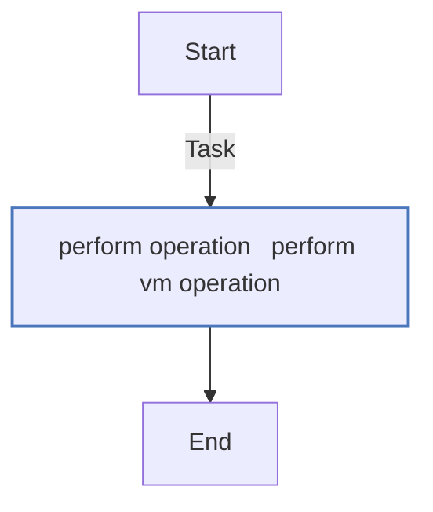
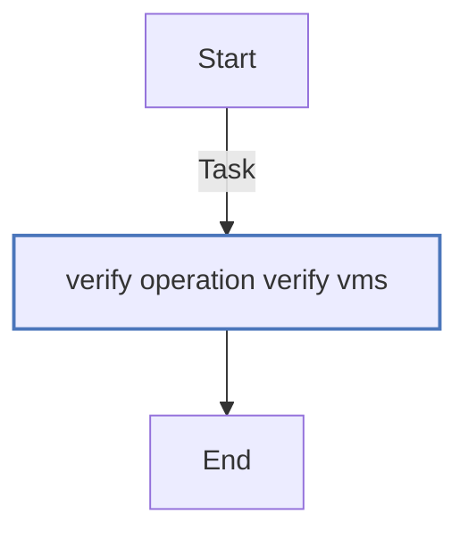
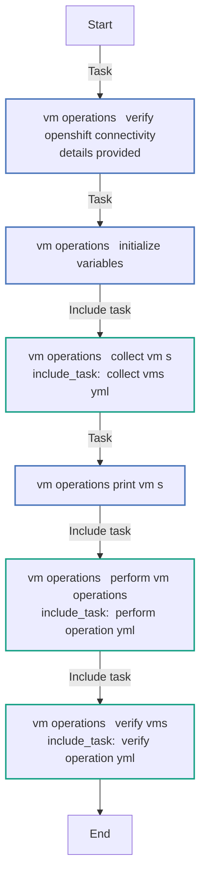
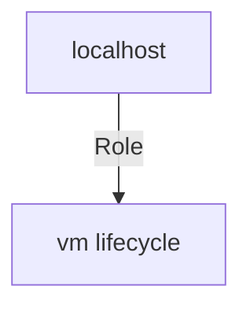

<!-- STATIC CONTENT START
Use this section for adding additional content to the README
This will not be overwritten by Docsible -->
# 📃 Role overview

This role performs and manages the lifecycle operations (start/stop/restart) of Virtual Machines.

<!-- STATIC CONTENT END -->
<!-- Everything below will be overwritten by Docsible -->
<!-- DOCSIBLE START -->
## vm_lifecycle

```
Role belongs to infra/openshift_virtualization_ops
Namespace - infra
Collection - openshift_virtualization_ops
```

Description: Management of the lifecycle activities of Virtual Machines.

### Defaults

**These are static variables with lower priority**

#### File: defaults/main.yml

| Var          | Type         | Value       |Choices    |Required    | Title       |
|--------------|--------------|-------------|-------------|-------------|-------------|
| [`vm_lifecycle_vm_operations_request`](defaults/main.yml#L6)   | list   | `[]` |  None  |   True  |  List of VMs to perform lifecycle operations |
| [`vm_lifecycle_kubevirt_api_version`](defaults/main.yml#L17)   | str   | `kubevirt.io/v1` |  None  |   True  |  KubeVirt API Version |
| [`vm_lifecycle_openshift_host`](defaults/main.yml#L21)   | str   | `{{ openshift_host }}` |  None  |   True  |  OpenShift host |
| [`vm_lifecycle_openshift_api_key`](defaults/main.yml#L25)   | str   | `{{ openshift_api_key }}` |  None  |   True  |  OpenShift API Key |
| [`vm_lifecycle_openshift_verify_ssl`](defaults/main.yml#L29)   | str   | `{{ openshift_verify_ssl }}` |  None  |   True  |  Enable SSL Verification |
| [`vm_lifecycle_verify_retries`](defaults/main.yml#L34)   | int   | `100` |  None  |   True  |  Number of retries |
| [`vm_lifecycle_verify_delay`](defaults/main.yml#L38)   | int   | `10` |  None  |   True  |  Number of delays |

<summary><b>🖇️ Full descriptions for vars in defaults/main.yml</b></summary>
<br>
<b>`vm_lifecycle_vm_operations_request`:</b> List of VM Lifecycle Operation requests
<br>
<b>`vm_lifecycle_kubevirt_api_version`:</b> KubeVirt API Version
<br>
<b>`vm_lifecycle_openshift_host`:</b> OpenShift host
<br>
<b>`vm_lifecycle_openshift_api_key`:</b> OpenShift API Key
<br>
<b>`vm_lifecycle_openshift_verify_ssl`:</b> Variable to enable SSL verification
<br>
<b>`vm_lifecycle_verify_retries`:</b> Number of retries
<br>
<b>`vm_lifecycle_verify_delay`:</b> Number of delays
<br>
<br>

### Vars

**These are variables with higher priority**

#### File: vars/main.yml

| Var          | Type         | Value       |
|--------------|--------------|-------------|
| [vm_lifecycle_valid_vm_operations](vars/main.yml#L2)   | dict   | `{}` |
| [vm_lifecycle_valid_vm_operations.start](vars/main.yml#L3)   | dict   | `{}` |
| [vm_lifecycle_valid_vm_operations.start.endpoint](vars/main.yml#L4)   | str   | `start` |
| [vm_lifecycle_valid_vm_operations.start.status](vars/main.yml#L5)   | str   | `Running` |
| [vm_lifecycle_valid_vm_operations.start.ready](vars/main.yml#L6)   | bool   | `True` |
| [vm_lifecycle_valid_vm_operations.stop](vars/main.yml#L7)   | dict   | `{}` |
| [vm_lifecycle_valid_vm_operations.stop.endpoint](vars/main.yml#L8)   | str   | `stop` |
| [vm_lifecycle_valid_vm_operations.stop.status](vars/main.yml#L9)   | str   | `Stopped` |
| [vm_lifecycle_valid_vm_operations.restart](vars/main.yml#L10)   | dict   | `{}` |
| [vm_lifecycle_valid_vm_operations.restart.endpoint](vars/main.yml#L11)   | str   | `restart` |
| [vm_lifecycle_valid_vm_operations.restart.status](vars/main.yml#L12)   | str   | `Running` |
| [vm_lifecycle_valid_vm_operations.restart.ready](vars/main.yml#L13)   | bool   | `True` |
| [vm_lifecycle_valid_vm_operations.restart.idempotent](vars/main.yml#L14)   | bool   | `True` |

### Tasks

#### File: tasks/_collect_vms.yml

| Name | Module | Has Conditions |
| ---- | ------ | --------- |
| _collect_vms ¦ Verify Valid VM Operation | `ansible.builtin.assert` | False |
| _collect_vms ¦ Verify Namespace Provided When Name Specified | `ansible.builtin.assert` | True |
| _collect_vms ¦ Query VM's Without Label Selector | `block` | True |
| _collect_vms ¦ Query VM's (Without Label Selector) | `kubernetes.core.k8s_info` | False |
| _collect_vms ¦ Add VM's (Without Label Selector) | `ansible.builtin.set_fact` | True |
| _collect_vms ¦ Query VM's Using Label Selector | `block` | True |
| _collect_vms ¦ Query VM's (With Label Selector) | `kubernetes.core.k8s_info` | False |
| _collect_vms ¦ Add VM's (With Label Selector) | `ansible.builtin.set_fact` | True |

#### File: tasks/_perform_operation.yml

| Name | Module | Has Conditions |
| ---- | ------ | --------- |
| _perform_operation ¦ Perform VM Operation | `ansible.builtin.uri` | False |

#### File: tasks/_verify_operation.yml

| Name | Module | Has Conditions |
| ---- | ------ | --------- |
| _verify_operation ¦ Verify VMs | `kubernetes.core.k8s_info` | False |

#### File: tasks/vm_operations.yml

| Name | Module | Has Conditions |
| ---- | ------ | --------- |
| vm_operations ¦ Verify OpenShift Connectivity Details Provided | `ansible.builtin.assert` | False |
| vm_operations ¦ Initialize Variables | `ansible.builtin.set_fact` | False |
| vm_operations ¦ Collect VM's | `ansible.builtin.include_tasks` | False |
| vm_operations ¦ Print VM's | `ansible.builtin.debug` | False |
| vm_operations ¦ Perform VM Operations | `ansible.builtin.include_tasks` | False |
| vm_operations ¦ Verify VMs | `ansible.builtin.include_tasks` | False |

## Task Flow Graphs

### Graph for _collect_vms.yml

```mermaid
flowchart TD
Start
classDef block stroke:#3498db,stroke-width:2px;
classDef task stroke:#4b76bb,stroke-width:2px;
classDef includeTasks stroke:#16a085,stroke-width:2px;
classDef importTasks stroke:#34495e,stroke-width:2px;
classDef includeRole stroke:#2980b9,stroke-width:2px;
classDef importRole stroke:#699ba7,stroke-width:2px;
classDef includeVars stroke:#8e44ad,stroke-width:2px;
classDef rescue stroke:#665352,stroke-width:2px;

  Start-->|Task| _collect_vms___Verify_Valid_VM_Operation0[ collect vms   verify valid vm operation]:::task
  _collect_vms___Verify_Valid_VM_Operation0-->|Task| _collect_vms___Verify_Namespace_Provided_When_Name_Specified1[ collect vms   verify namespace provided when name<br>specified<br>When: **name  in vm operations request instance**]:::task
  _collect_vms___Verify_Namespace_Provided_When_Name_Specified1-->|Block Start| _collect_vms___Query_VM_s_Without_Label_Selector2_block_start_0[[ collect vms   query vm s without label selector<br>When: **label selectors  not in vm operations request<br>instance**]]:::block
  _collect_vms___Query_VM_s_Without_Label_Selector2_block_start_0-->|Task| _collect_vms___Query_VM_s__Without_Label_Selector_0[ collect vms   query vm s  without label selector ]:::task
  _collect_vms___Query_VM_s__Without_Label_Selector_0-->|Task| _collect_vms___Add_VM_s__Without_Label_Selector_1[ collect vms   add vm s  without label selector <br>When: **vm lifecycle vm operations vms   default      <br>map attribute  vm     list    selectattr  metadata<br>namespace    equalto   vm no label selectors<br>response metadata namespace    list   selectattr <br>metadata name    equalto   vm no label selectors<br>response metadata name    list   length    0 and  <br>namespace  in vm operations request instance and <br>names  in vm operations request instance and vm no<br>label selectors response metadata name in vm<br>operations request instance  names    or  <br>namespace  in vm operations request instance and <br>names  not in vm operations request instance  or  <br>namespace  not in vm operations request instance <br>and   idempotent  in vm lifecycle valid vm<br>operations vm operations request instance <br>operation    and vm lifecycle valid vm operations<br>vm operations request instance  operation   <br>idempotent bool  or   status  in vm no label<br>selectors response and  printablestatus  in vm no<br>label selectors response status and vm no label<br>selectors response status printablestatus    vm<br>lifecycle valid vm operations vm operations<br>request instance  operation    status**]:::task
  _collect_vms___Add_VM_s__Without_Label_Selector_1-.->|End of Block| _collect_vms___Query_VM_s_Without_Label_Selector2_block_start_0
  _collect_vms___Add_VM_s__Without_Label_Selector_1-->|Block Start| _collect_vms___Query_VM_s_Using_Label_Selector3_block_start_0[[ collect vms   query vm s using label selector<br>When: **label selectors  in vm operations request<br>instance**]]:::block
  _collect_vms___Query_VM_s_Using_Label_Selector3_block_start_0-->|Task| _collect_vms___Query_VM_s__With_Label_Selector_0[ collect vms   query vm s  with label selector ]:::task
  _collect_vms___Query_VM_s__With_Label_Selector_0-->|Task| _collect_vms___Add_VM_s__With_Label_Selector_1[ collect vms   add vm s  with label selector <br>When: **vm lifecycle vm operations vms   default      <br>map attribute  vm     list    selectattr  metadata<br>namespace    equalto   vm label selectors response<br>metadata namespace    list   selectattr  metadata<br>name    equalto   vm label selectors response<br>metadata name    list   length    0 and  <br>idempotent  in vm lifecycle valid vm operations vm<br>operations request instance  operation    and vm<br>lifecycle valid vm operations vm operations<br>request instance  operation    idempotent bool  or<br>  status  in vm label selectors response and <br>printablestatus  in vm label selectors response<br>status and vm label selectors response status<br>printablestatus    vm lifecycle valid vm<br>operations vm operations request instance <br>operation    status**]:::task
  _collect_vms___Add_VM_s__With_Label_Selector_1-.->|End of Block| _collect_vms___Query_VM_s_Using_Label_Selector3_block_start_0
  _collect_vms___Add_VM_s__With_Label_Selector_1-->End
```



### Graph for _perform_operation.yml



### Graph for _verify_operation.yml



### Graph for vm_operations.yml



## Playbook

```yml
---
- name: Test
  hosts: localhost
  remote_user: root
  roles:
    - vm_lifecycle
...

```

## Playbook graph



## Author Information

OpenShift Virtualization Migration Contributors

## License

GPL-3.0-only

## Minimum Ansible Version

2.15.0

## Platforms

No platforms specified.

<!-- DOCSIBLE END -->