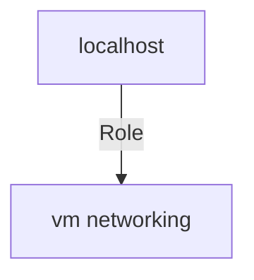

<!-- STATIC CONTENT START
Use this section for adding additional content to the README
This will not be overwritten by Docsible -->
# 📃 Role overview

<!-- STATIC CONTENT END -->
<!-- Everything below will be overwritten by Docsible -->
<!-- DOCSIBLE START -->
## vm_networking

```
Role belongs to infra/openshift_virtualization_ops
Namespace - infra
Collection - openshift_virtualization_ops
Version - 1.0.3
Repository - https://github.com/redhat-cop/openshift_virtualization_ops
```

Description: Management of Virtual Machine networking.

### Tasks

## Playbook

```yml
---
- name: Test
  hosts: localhost
  remote_user: root
  roles:
    - vm_networking
...

```

## Playbook graph



## Author Information

OpenShift Virtualization Migration Contributors

## License

GPL-3.0-only

## Minimum Ansible Version

2.15.0

## Platforms

No platforms specified.

<!-- DOCSIBLE END -->